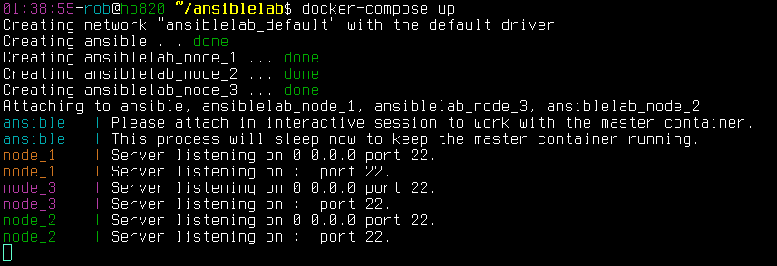
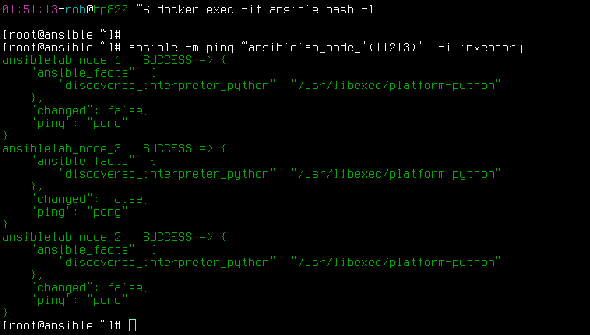
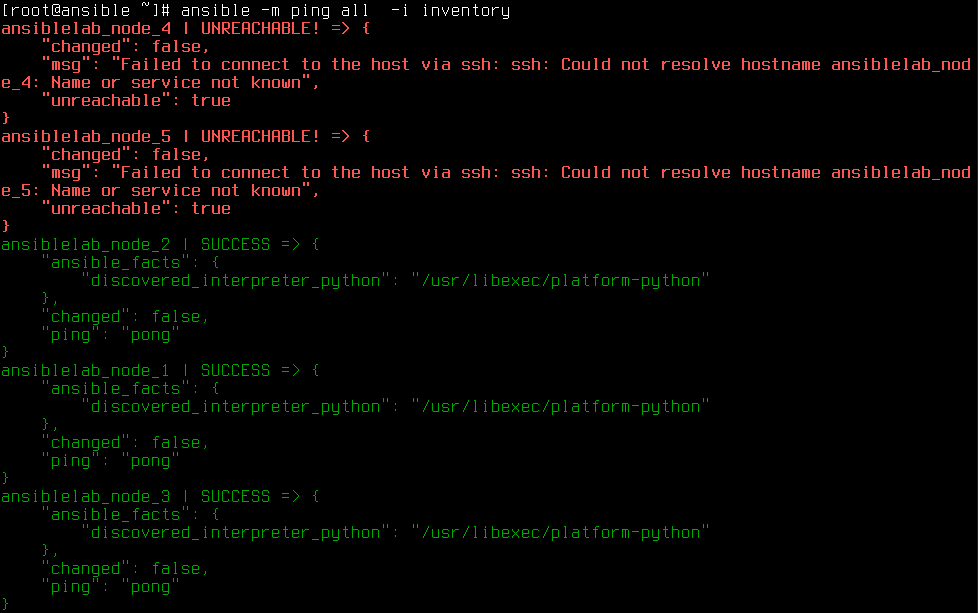
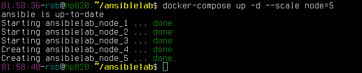
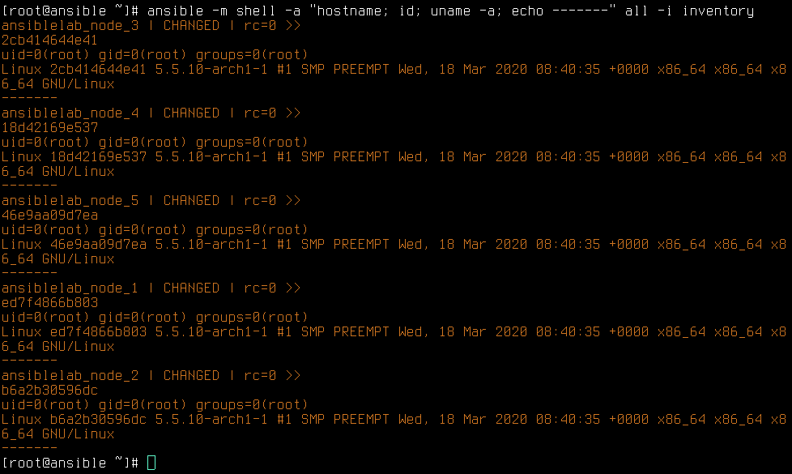
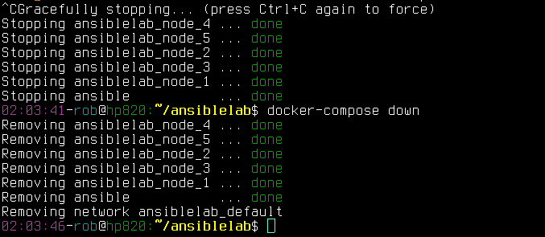

# ansiblelab
Personal Ansible playground (based on Docker, Docker-composer, Centos8)

Contact: Robert Nowotniak <rnowotniak@gmail.com>

Tested on ArchLinux as the Docker host.

## Quick start

Download the image from my
[Dockerhub](https://hub.docker.com/u/rnowotniak) account, and clone this repository from my
[github](https://github.com/rnowotniak/ansiblelab) repository:

    docker pull rnowotniak/ansiblelab
    git clone https://github.com/rnowotniak/ansiblelab

Create ssh keys which will be used to communicate betwen the master and the nodes in your new Ansible lab:

    cd ansiblelab
    ssh-keygen -q -N "" -f keys/ansiblekey

Start the containers

    docker-compose up

## Working with the lab environment

Having the master and the nodes up and running (docker-compose up), you can enter the master container and run Ansible commands on the nodes.
A very basic configuration (ansible.cfg) and inventory ("inventory" file) is already copied there in the working directory.

There are 5 hosts in the default inventory (ansiblelab_node_1,
..., ansible_node_5).
To target hosts 1, 2 and 3 with Ansible ping module, run:

With just 3 nodes containers present, ping module will show error on 2 nodes if all 5 from the inventory are targetted:

To scale the number of hosts to 5 manually, you can use **"docker-compose up -d --scale node=5"** command as follows:

Run some shell command (Ansible "shell" module) on all 5 nodes from the inventory (query the host hostname, executive user ID, and uname):

To shutdown gracefully and cleanup everthing:

## How is this configured

Ansible node.
All required:
    generate ssh keys
    Start sshd server
    copy private key to Ansible master

Ansible master.
    Configure inventories
    ssh -i /keys/mykey 172.17.0.3

## Some useful commands

* ansible all -m ping
* ansible all -m ping -i inv
* ansible all -m shell -a "uname -a" --ask-pass
* docker run -v $PWD/keys:/keys:ro -it --name ansible_node2 -h ansible_node2 --rm anstmp
* docker run -v $PWD/keys:/root/.ssh -it centos

## Some useful links

* https://www.cyberciti.biz/python-tutorials/linux-tutorial-install-ansible-configuration-management-and-it-automation-tool/
* https://wiki.archlinux.org/index.php/Ansible
* https://www.cyberciti.biz/python-tutorials/linux-tutorial-install-ansible-configuration-management-and-it-automation-tool/

